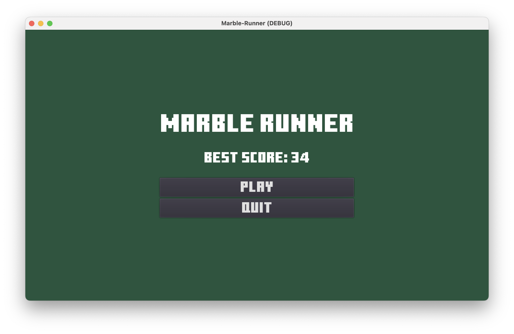
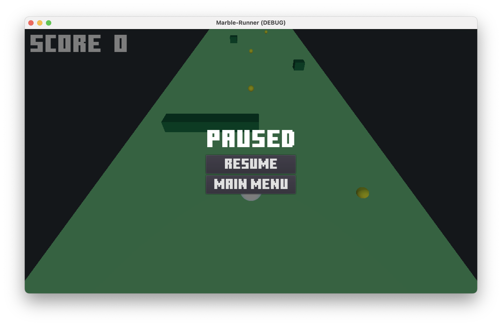
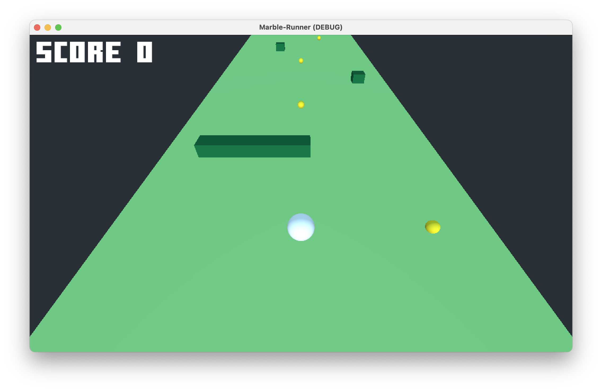
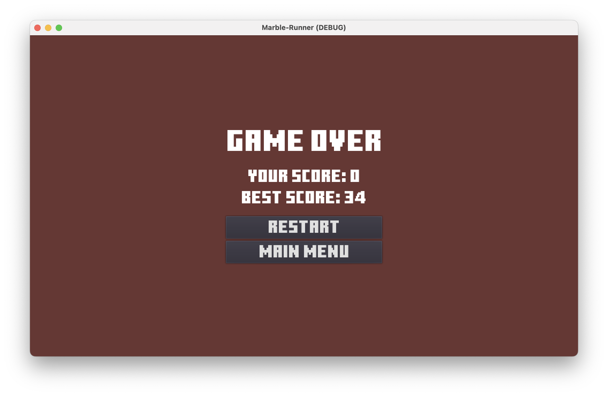

# MarbleRunner

A godot game about endless runner with dynamic obstacle generation.

Live version is deployed at [https://kaushalmeena.github.io/marble-runner/Marble-Runner.html](https://kaushalmeena.github.io/marble-runner/Marble-Runner.html)

## Getting Started

These instructions will get you a copy of the project up and running on your local machine for development purposes.

### Requirements

To install and run this project you need:

- [Godot 3.4](https://godotengine.org/download/ "Godot 3.4")
- [NodeJS](https://nodejs.org/ "NodeJS")
- [git](https://git-scm.com/downloads "git") (only to clone this repository)

### Installation

To set up everything in your local machine, you need to follow these steps:

1. Clone this repo onto your computer:

```bash
$ git clone https://github.com/kaushalmeena/marble-runner.git
```

2. Open Godot and click on Import->Browse

3. Navigate to `marble-runner` folder and click Open


## Screenshots

 




## License

This project is licensed under the MIT License - see the [LICENSE](LICENSE) file for details.
