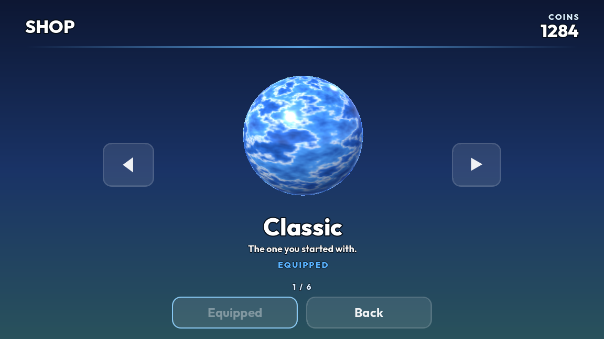

<div align="center">


# Marble Runner

[](LICENSE) [](https://godotengine.org/) [](https://docs.godotengine.org/en/stable/tutorials/scripting/gdscript/index.html)

**An endless runner that gets faster every metre you survive.**

Roll a marble down a winding five-lane track. Dodge what you can't jump, grab
fruit to build a multiplier, and pick your pickups carefully, because some of
them are traps.

[**Try it live**](https://kaushalmeena.github.io/marble-runner/)

</div>

---

## Screenshots

<table>
  <tr>
    <td width="50%"></td>
    <td width="50%"></td>
  </tr>
</table>

<details>
<summary>More screenshots</summary>

<table>
  <tr>
    <td width="50%"></td>
    <td width="50%"></td>
  </tr>
</table>

</details>

## Features

- **A road that bends** — the track winds, but the bend is zero where you are
  standing, so a lane is always a lane.
- **Nine obstacles** — trees, bushes, rocks, logs and crystals across one to
  three lanes, plus a hazard that drifts sideways as it comes at you.
- **Jump the low ones** — rocks and logs clear, bushes and trees don't. Height
  decides that, not a flag on the prop.
- **Eight pickups, three of them bad** — rounded and cool-coloured helps you,
  spiked and red does not.
- **Streaks and near misses** — five fruit in a row steps the multiplier to ×5,
  and shaving past an obstacle pays a bonus.
- **Coins** — spend them on marbles in the shop, or on one more chance when you
  crash.
- **Four biomes** that cross-fade as the run gets longer.

## Tech Stack

| Area         | Tools                                                                                                         |
| ------------ | --------------------------------------------------------------------------------------------------------------- |
| **Engine**   | [Godot 4.7](https://godotengine.org/), Compatibility renderer for the web build                                |
| **Language** | [GDScript 2](https://docs.godotengine.org/en/stable/tutorials/scripting/gdscript/index.html), statically typed  |
| **Art**      | Primitive meshes, shared materials, one shader for the curved ground                                           |
| **Type**     | [Outfit](https://fonts.google.com/specimen/Outfit)                                                             |
| **Audio**    | Generated with Python's [`wave`](https://docs.python.org/3/library/wave.html) module                           |
| **Hosting**  | [GitHub Pages](https://pages.github.com/)                                                                      |

## Getting Started

These instructions will get you a copy of the project up and running on your
local machine for development purposes.

### Requirements

To install and run this project you need:

- [Godot 4.7](https://godotengine.org/download/) or newer
- [git](https://git-scm.com/downloads) (only to clone this repository)

### Installation

To set up everything on your local machine, follow these steps:

1. Clone this repo and then change directory to the `marble-runner` folder:

```bash
git clone https://github.com/kaushalmeena/marble-runner.git
cd marble-runner
```

2. Import the project, either by opening `project.godot` in the editor or from
   the command line:

```bash
godot --headless --import
```

### Running

To play the game:

```bash
godot
```

### Building

To export the web build:

```bash
godot --headless --export-release "Web" dist/web/index.html
```

Output lands in `dist/web`. The `Web` preset is committed, so this works on a
fresh clone once the matching export templates are installed.

## Usage

| Action       | Keyboard             | Touch or mouse   |
| ------------ | -------------------- | ---------------- |
| Switch lanes | `←` `→` or `A` `D`   | Swipe left/right |
| Jump         | `Space`, `↑` or `W`  | Swipe up, or tap |
| Pause        | `Esc` or `P`         | —                |

## Deployment

Pushing to `main` exports the game and publishes it to GitHub Pages, via the
[deploy workflow](.github/workflows/deploy.yml). Pages needs its source set to
GitHub Actions for that to land.

## Credits

- [Outfit](https://fonts.google.com/specimen/Outfit) by **Smartsheet Inc.**,
  licensed under the [SIL Open Font License 1.1](assets/fonts/OFL.txt).

## Documentation

Full documentation is available in the [`/docs`](./docs) directory.

- [Architecture](./docs/architecture.md) — how the world scrolls past a
  stationary marble, and which parts know about each other.
- [Adding an Obstacle](./docs/adding-obstacles.md) — the scene, the spawn entry,
  and why height alone decides what can be jumped.
- [Biomes](./docs/biomes.md) — how the palette cross-fades with distance.

## Contributing

Contributions are welcome! If you find a bug or have a feature request, please
[open an issue](https://github.com/kaushalmeena/marble-runner/issues/new/choose)
first to discuss it. For code changes, fork the repository, create a branch,
and open a pull request.

## License

This project is licensed under the MIT License — see the [LICENSE](LICENSE)
file for details.
