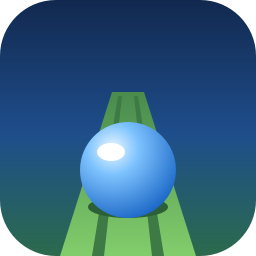
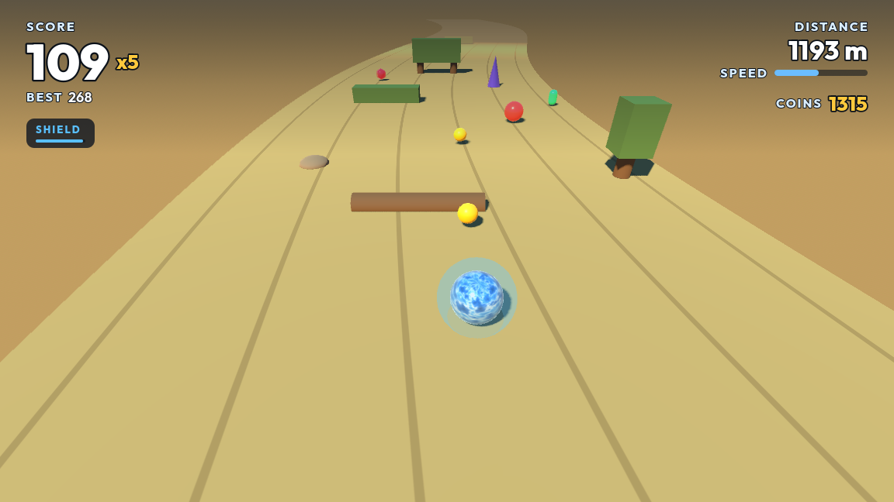
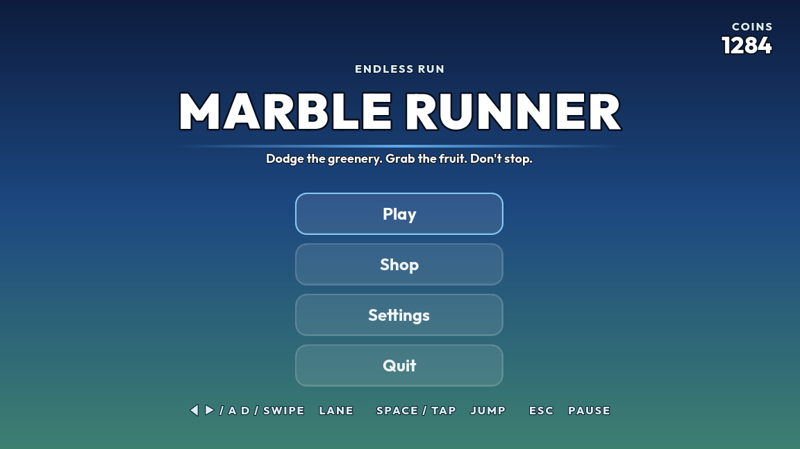
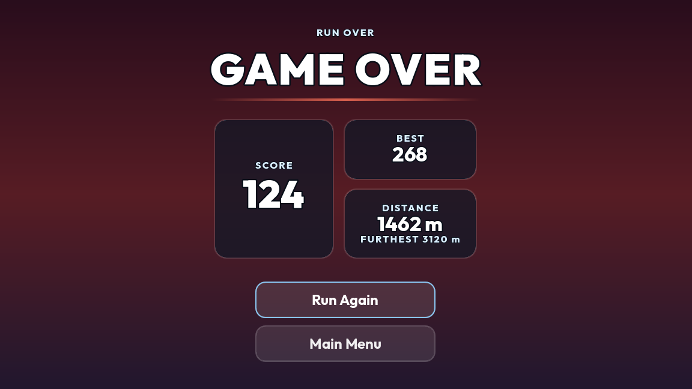
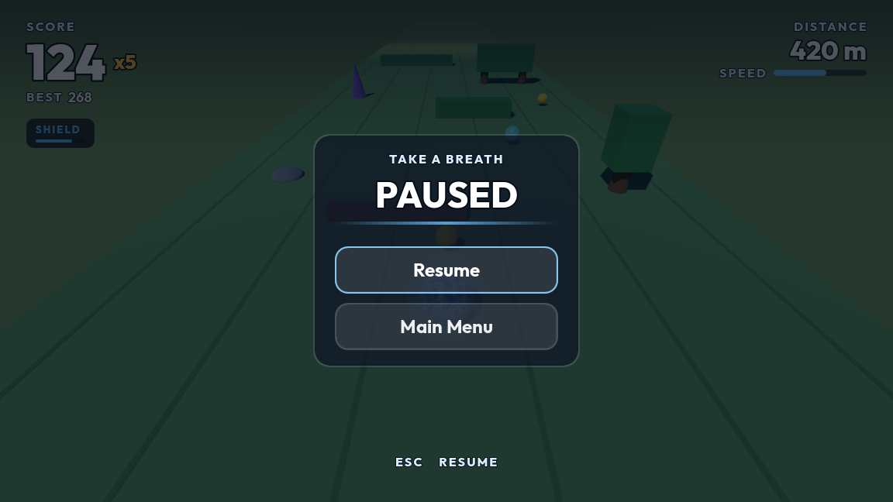

<div align="center">



# Marble Runner

[](LICENSE) [](https://godotengine.org/) [](https://docs.godotengine.org/en/stable/tutorials/scripting/gdscript/index.html)

**An endless runner that gets faster every metre you survive.**

Roll a marble down a five-lane track that scrolls at you harder the longer you
last. Dodge trees, bushes and crystals, hurdle the low stuff, grab fruit to
build a **score multiplier**, and chase power-ups that buy you a few seconds of
mercy. Obstacles are drawn from a weighted table, so no two runs lay out the
same way.

[**Try it live**](https://kaushalmeena.github.io/marble-runner/)

</div>

---

## Screenshots

<table>
  <tr>
    <td width="50%"></td>
    <td width="50%"></td>
  </tr>
</table>

<details>
<summary>More screenshots</summary>

<table>
  <tr>
    <td width="50%"></td>
    <td width="50%"></td>
  </tr>
</table>

</details>

## Features

- **Difficulty that ramps, not spikes** — speed climbs smoothly with distance
  and is capped, while obstacles stay a constant distance apart, so the track
  gets faster without ever getting unfair.
- **Eight obstacle types, weighted** — trees, bushes, rocks, logs and crystals
  across one, two and three lanes, drawn from a table you can re-balance
  without touching code.
- **Jump the low ones** — rocks and fallen logs can be cleared, bushes and trees
  cannot. Which is which falls out of the obstacle's height, not a flag.
- **Three power-ups** — a shield that eats one hit, a magnet that drags fruit
  to you, and slow-mo that takes the edge off the speed.
- **Streaks and near misses** — five fruit in a row steps the multiplier up to
  ×5, and slipping past an obstacle by a hair pays a bonus.
- **Four biomes** — meadow, desert, tundra and dusk cross-fade as you go, and
  loop, so a long run keeps changing.
- **Plays with anything** — keyboard, or swipe and tap on touch and in the web
  build.

## How It Works

The marble never actually moves forward. It sits still and the world is pulled
past it, which is what keeps a genuinely endless track cheap to run:

1. **One loop moves everything** — `Track` owns the position and lifetime of
   every prop on screen. The props themselves carry no scripts at all.
2. **Props are pooled** — anything that scrolls past the camera is hidden, taken
   out of collision, and handed back for the next spawn, so a long run stops
   allocating.
3. **Spawning is measured in metres, not seconds** — obstacle spacing stays
   constant as the speed climbs, so rising speed is the only thing making the
   game harder.
4. **The world is recoloured, not rebuilt** — biomes tint the shared materials
   and the environment, which re-skins every prop at once.

> Every sound effect is generated from scratch by a Python script, so the game
> ships with no third-party audio and nothing to license.

## Tech Stack

| Area         | Tools                                                                                                           |
| ------------ | --------------------------------------------------------------------------------------------------------------- |
| **Engine**   | [Godot 4.7](https://godotengine.org/) (Compatibility renderer, for the web export)                               |
| **Language** | [GDScript 2](https://docs.godotengine.org/en/stable/tutorials/scripting/gdscript/index.html) (statically typed)   |
| **Art**      | Primitive meshes sharing [StandardMaterial3D](https://docs.godotengine.org/en/stable/classes/class_standardmaterial3d.html) resources |
| **Type**     | [Outfit](https://fonts.google.com/specimen/Outfit) variable font                                                 |
| **Audio**    | Generated offline with Python's [`wave`](https://docs.python.org/3/library/wave.html) module                     |
| **Hosting**  | [GitHub Pages](https://pages.github.com/) via [gh-pages](https://github.com/tschaub/gh-pages)                    |

## Getting Started

These instructions will get you a copy of the project up and running on your
local machine for development purposes.

### Requirements

To install and run this project you need:

- [Godot 4.7](https://godotengine.org/download/) or newer
- [Node.js](https://nodejs.org/) 18+ (only to deploy the web build)
- [git](https://git-scm.com/downloads) (only to clone this repository)

### Installation

To set up everything on your local machine, follow these steps:

1. Clone this repo and then change directory to the `marble-runner` folder:

```bash
git clone https://github.com/kaushalmeena/marble-runner.git
cd marble-runner
```

2. Import the project, either by opening `project.godot` in the Godot editor or
   by letting the engine do it from the command line:

```bash
godot --headless --import
```

3. Install the deploy tooling, only if you intend to publish by hand rather
   than letting CI do it:

```bash
npm install
```

### Running

To play the game:

```bash
godot
```

To skip the menu and drop straight into a run:

```bash
godot res://game/game.tscn
```

### Building

To export the web build:

```bash
godot --headless --export-release "Web" dist/web/index.html
```

The build output is written to the `dist/web` folder. The `Web` preset is
committed in `export_presets.cfg`, so this works on a fresh clone as long as
the matching export templates are installed.

## Usage

Once a run starts, the whole game is three inputs:

| Action       | Keyboard             | Touch or mouse   |
| ------------ | -------------------- | ---------------- |
| Switch lanes | `←` `→` or `A` `D`   | Swipe left/right |
| Jump         | `Space`, `↑` or `W`  | Swipe up, or tap |
| Pause        | `Esc` or `P`         | —                |
| Menus        | Arrow keys, `Enter`  | Click            |

Only the low obstacles can be jumped. Rocks and fallen logs clear at the top of
the arc; bushes, trees and crystals have to be gone around.

## Deployment

Every push to `main` is exported and published to GitHub Pages by the
[deploy workflow](.github/workflows/deploy.yml). It downloads the pinned Godot
version and its export templates, caches them, exports the `Web` preset and
uploads the result — no manual step.

This needs **Settings → Pages → Source** set to **GitHub Actions** once. The
`npm run deploy` script remains as a manual fallback, but it publishes to the
`gh-pages` branch, so only one of the two can be the live source at a time.

## Credits

- [Outfit](https://fonts.google.com/specimen/Outfit) by **Smartsheet Inc.**,
  licensed under the [SIL Open Font License 1.1](assets/fonts/OFL.txt).

## Documentation

Full documentation is available in the [`/docs`](./docs) directory.

**Understanding the project:**

- [Architecture](./docs/architecture.md) — how the world scrolls past a
  stationary marble, and which parts are allowed to know about each other.

**Extending it:**

- [Adding an Obstacle](./docs/adding-obstacles.md) — the scene, the spawn entry,
  and why height alone decides whether something can be jumped.
- [Biomes](./docs/biomes.md) — how the palette cross-fades with distance, and
  what to fill in to add one.

## Contributing

Contributions are welcome! If you find a bug or have a feature request, please
[open an issue](https://github.com/kaushalmeena/marble-runner/issues/new/choose)
first to discuss it. For code changes, fork the repository, create a branch,
and open a pull request.

## License

This project is licensed under the MIT License — see the [LICENSE](LICENSE)
file for details.
